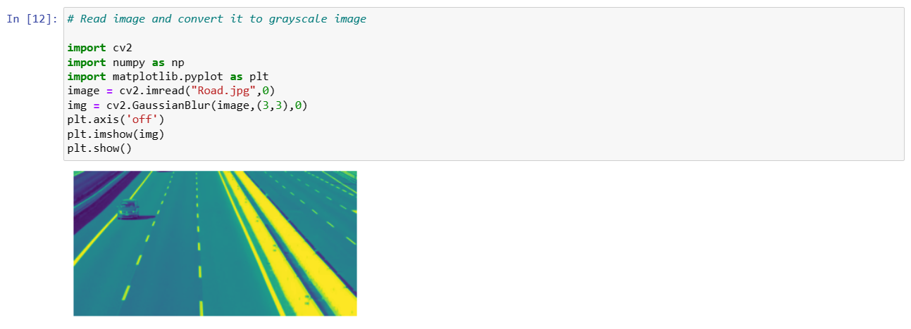
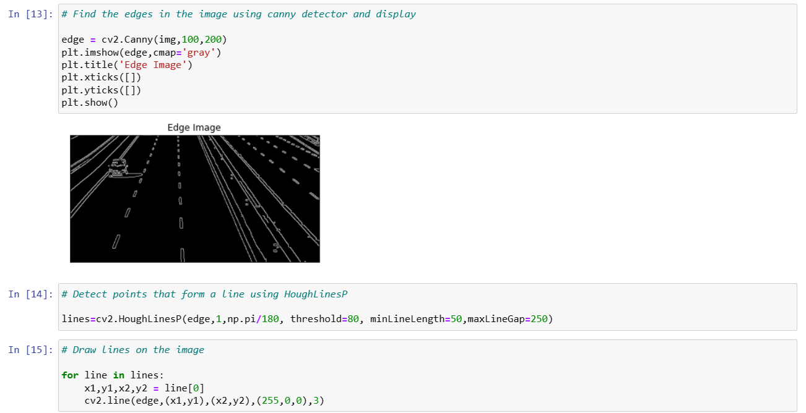
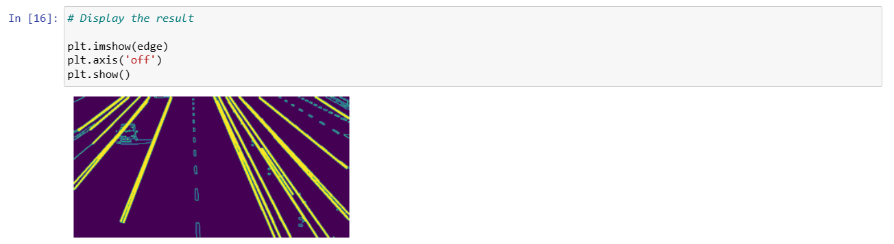

# EDGE LINKING USING HOUGH TRANSFORM
## AIM:
To write a Python program to detect the lines using Hough Transform.

## SOFTWARE REQUIRED:
Anaconda - Python 3.7

## ALGORITHM:
### STEP 1:
Import all the necessary modules for the program.

### STEP 2:
Load a image using imread() from cv2 module.

### STEP 3:
Convert the image to grayscale.

### STEP 4:
Using Canny operator from cv2,detect the edges of the image.

### STEP 5:
Using the HoughLinesP(),detect line co-ordinates for every points in the images.Using For loop,draw the lines on the found co-ordinates.

### STEP 6:
Display the image and end the program.

## PROGRAM:

```
NAME  : Paarkavy B
REG.NO: 212221230072 
```

### Read image and convert it to grayscale image
```
import cv2
import numpy as np
import matplotlib.pyplot as plt
image = cv2.imread("Road.jpg",0)
img = cv2.GaussianBlur(image,(3,3),0)
plt.axis('off')
plt.imshow(img)
plt.show()
```

### Find the edges in the image using canny detector and display
```
edge = cv2.Canny(img,100,200)
plt.imshow(edge,cmap='gray')
plt.title('Edge Image')
plt.xticks([])
plt.yticks([])
plt.show()
```

### Detect points that form a line using HoughLinesP
```
lines=cv2.HoughLinesP(edge,1,np.pi/180, threshold=80, minLineLength=50,maxLineGap=250)
```

### Draw lines on the image
```
for line in lines:
    x1,y1,x2,y2 = line[0]
    cv2.line(edge,(x1,y1),(x2,y2),(255,0,0),3)
```

### Display the result
```
plt.imshow(edge)
plt.axis('off')
plt.show()
```

## OUTPUT:

### Input image and grayscale image



### Canny Edge detector output



### Display the result of Hough transform



## RESULT:
Thus the program is written with python and OpenCV to detect lines using Hough transform. 
